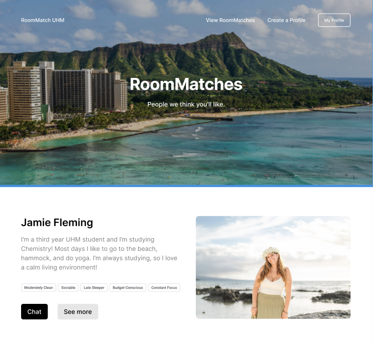
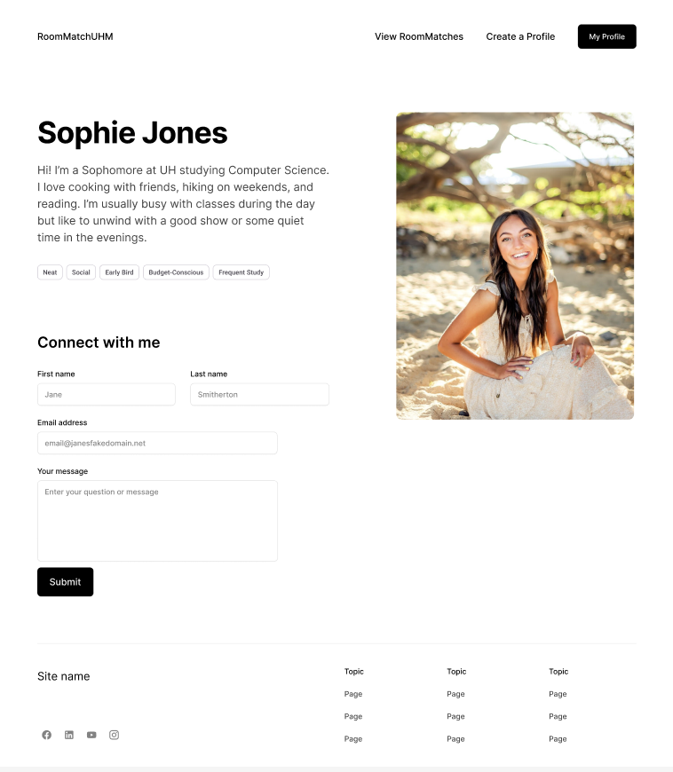
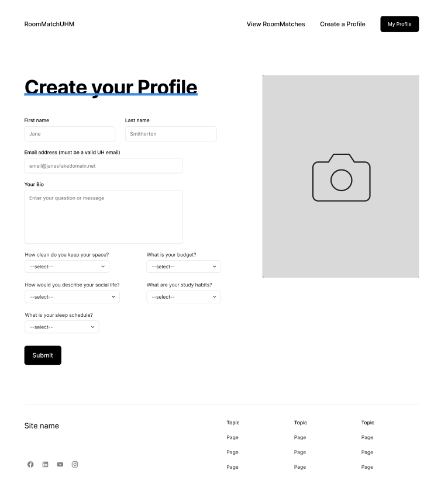

# RoomMatch UHM

Welcome to **RoomMatch UHM**, a student-focused housing compatibility platform designed to connect University of Hawaiʻi at Mānoa students seeking roommates or housing opportunities.

## Project Goals

- Match UH students with compatible roommates.
- Help students find housing near campus.
- Build a trusted community-based housing network.

## Planned Features

- UH email verification  
- Compatibility-based roommate matching  
- Room listings with filters and search  
- Secure in-app messaging  

## Team Members
- Brooke Clifton
- Ethan Garcia
- Harrison Gray
- Lara Miyakawa Ho
- Miley Chun

## Deployment

### Vercel Page
[Click Here]()

## Development

### M1 Progress Page
[Click Here](https://github.com/orgs/roommatch-uhm/projects/1)
### M2 Progress Page
[Click Here](https://github.com/orgs/roommatch-uhm/projects/5)

## Team Contract

RoomMatch UHM is designed and implemented by Brooke Clifton, Ethan Garcia, Harrison Gray, Lara Miyakawa Ho, and Miley Chun. Our collaborative agreement  outlines our team's shared goals, roles, and how members will interact to work together effectively.

[Click Here](https://docs.google.com/document/d/1_-OBrYrziAiaBHlRvP3xNTNON9cxNEQYZn9Zfn4_QP4/edit?tab=t.0)

## Mockup Pages

### Landing Page

The first page users see when visiting RoomMatch UHM:
- "Get Started" button and introduction to the app.
- Navigation options at the top: View RoomMatches, Create a Profile, and My Profile.
- Example testimonies from other students using the app to encourage engagement.
  

### Matches Page

Shows students that our algorithm predicts as compatible roommates:
- Displays potential roommates with a brief profile summary.
- Users can click on the Chat button to start a conversation.
- Helps students find matches quickly and efficiently.

### Profile Page

Displays an individual student's complete profile:
- View detailed information about the student.
- Enter your own information and send a message to reach out to the student.

### Create Profile

Allows students to set up their profile for matching:
- Input personal and contact information.
- Answer questions such as:
  - What is your budget?
  - What are your study habits?
  - What is your sleep schedule?
- Submitting the profile enables the app to generate compatibility-based roommate suggestions.

### Messages Page

The Messages Page enables users to chat directly with their potential or matched roommates in a clean, easy-to-use interface. It is designed to encourage open communication, allowing students to coordinate housing details, discuss compatibility, or simply get to know each other before moving in.

Features:
- Chat interface with message bubbles for clear distinction between users.
- Displays a list of people you are messaging on the left and the conversation on the right.
- Includes user profile pictures for easy identification.
- Responsive layout that adapts to both mobile and desktop screens.
  

### Meetings Page
The Meetings Page helps students stay organized by managing upcoming roommate meetups or housing-related appointments. It features an interactive calendar where users can view, add, edit, and cancel meetings with ease.

Features:
- Interactive React Calendar showing all scheduled meetings.
- Add new meetings with title, date, and time.
- Edit or cancel existing meetings using simple form controls.
- Highlighted days indicate scheduled meetings for quick visual reference.

Features:

---
© 2025 RoomMatch UHM • Created by the RoomMatch UHM Team
